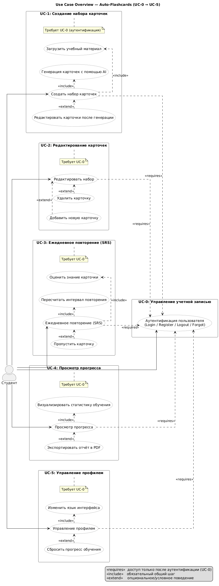
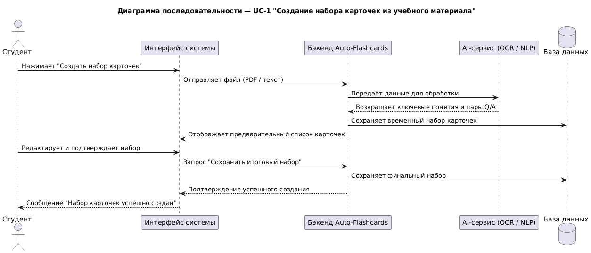
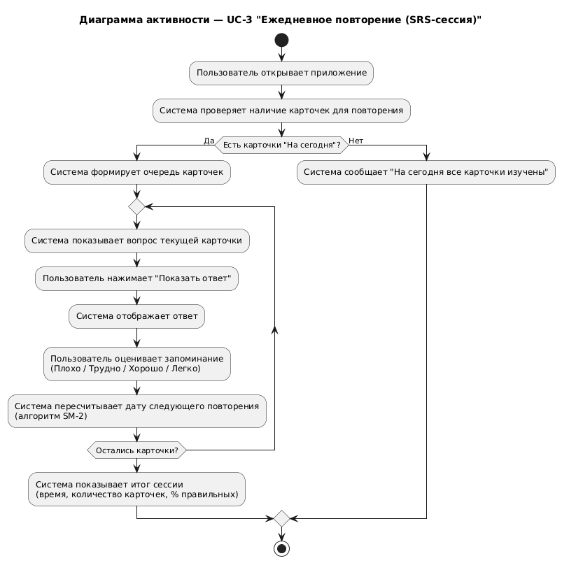

# Auto-Flashcards — Сценарии использования (Use Cases)

> Документ описывает основные сценарии взаимодействия пользователей с системой Auto-Flashcards.  
> Цель — формализовать функциональные требования через пользовательские сценарии и обеспечить единое понимание работы системы.

---

## Общая информация

**Система:** Auto-Flashcards  
**Категория:** Образование  

**Основные акторы:**
- **Студент** — основной пользователь, создаёт и изучает карточки.  
- **Преподаватель** — создаёт и делится наборами карточек с группой.  
- **Внешние AI-сервисы (LLM / OCR)** — внешние системы, используемые для обработки данных и генерации карточек.

**Границы системы:**  
Auto-Flashcards принимает на вход учебные материалы (PDF, текст, видео), извлекает ключевые понятия, генерирует карточки «вопрос-ответ» и организует интервальное повторение.

---

## UC-1 — Создание набора карточек из учебного материала

### Диаграмма последовательности UC-1

_(Рисунок 1 — Диаграмма последовательности сценария "Создание набора карточек")_

**Цель:**  
Преобразовать учебный материал (PDF/текст) в набор карточек с вопросами и ответами.

**Акторы:**  
Основной — Студент  
Вторичный — Внешние AI-сервисы (NLP, OCR)

**Предусловия:**
- Пользователь авторизован в системе.  
- Файл учебного материала подготовлен и соответствует требованиям (≤25MB).

**Триггер:**  
Пользователь нажимает кнопку «Создать набор» и загружает файл.

### Основной сценарий (Happy Path)

1. Студент выбирает опцию **«Создать набор карточек»**.  
2. Система предлагает загрузить файл (PDF, текст).  
3. Пользователь загружает файл, система проверяет формат и размер.  
4. Система извлекает текст и ключевые понятия (через NLP/OCR).  
5. Система генерирует первичный набор карточек с вопросами и ответами.  
6. Система отображает предварительный просмотр набора.  
7. Пользователь редактирует или удаляет ненужные карточки.  
8. Пользователь сохраняет готовый набор.  
9. Система сохраняет набор в профиле пользователя и уведомляет об успешном создании.

### Альтернативные потоки

**AF-1: Слишком большой файл (ветвление от шага 3)**  
3.1. Система сообщает, что файл превышает допустимый размер.  
3.2. Пользователь может выбрать — сжать файл, разделить его или отменить загрузку.  
3.3. После выбора система повторяет загрузку.

**AF-2: Нераспознанный текст (ветвление от шага 4)**  
4.1. Система сообщает, что часть текста не может быть извлечена.  
4.2. Пользователь может ввести текст вручную.  
4.3. Система повторяет генерацию карточек.

**AF-3: Неизвестный язык**  
4.1. Система предлагает выбрать язык вручную.  
4.2. Пользователь выбирает язык → генерация продолжается.

### Исключения (Negative Flows)

- **EX-1:** Ошибка соединения с внешним сервисом — система сообщает об ошибке и предлагает повторить позже.  
- **EX-2:** Обрыв соединения во время загрузки — система сохраняет состояние и предлагает возобновить.

### Постусловия

- Набор карточек успешно создан и сохранён.  
- Доступен для последующего редактирования и изучения.

### Критерии приёмки

- Файл обрабатывается менее чем за 60 секунд.  
- Система создаёт не менее 30 карточек для лекции из 20 страниц.  
- Ошибки отображаются понятным сообщением.

---

## UC-2 — Редактирование и улучшение набора карточек

**Цель:**  
Позволить студенту изменять, объединять и сортировать карточки по уровню сложности.

**Акторы:**  
Основной — Студент.

**Предусловия:**  
Существует ранее созданный набор карточек.

**Триггер:**  
Пользователь открывает набор и выбирает пункт «Редактировать».

### Основной сценарий

1. Студент открывает набор карточек.  
2. Система отображает список карточек.  
3. Пользователь выбирает карточку и нажимает «Редактировать».  
4. Пользователь изменяет текст вопроса, ответа или сложность.  
5. Система сохраняет изменения.  
6. Пользователь объединяет дублирующиеся карточки.  
7. Система обновляет набор и сообщает о сохранении.

### Альтернативные потоки

**AF-1: Отмена изменений** — пользователь выбирает «Отменить» → система восстанавливает предыдущую версию.  
**AF-2: Конфликт версий** — если изменения выполнены на другом устройстве, система предлагает объединить версии.

### Исключения

- **EX-1:** Ошибка при сохранении — система сохраняет локальную копию и предлагает повторить.  
- **EX-2:** Пустое поле — система выдаёт сообщение об ошибке.

### Постусловия

Набор карточек обновлён и доступен для дальнейшего использования.

### Критерии приёмки

- Все изменения сохраняются корректно.  
- Удаление и объединение карточек не приводит к потере данных.

---

## UC-3 — Ежедневное повторение (SRS-сессия)

### Диаграмма активности UC-3

_(Рисунок 2 — Диаграмма активности сценария "Ежедневное повторение")_

**Цель:**  
Реализовать процесс интервального повторения карточек для повышения запоминания.

**Акторы:**  
Студент.

**Предусловия:**  
Существует хотя бы один набор карточек с элементами, подлежащими повторению.

**Триггер:**  
Пользователь нажимает «Начать повторение».

### Основной сценарий

1. Система выбирает карточки, срок повторения которых наступил.  
2. Система отображает вопрос.  
3. Пользователь запрашивает ответ.  
4. Система показывает ответ и предлагает оценить запоминание (Плохо / Трудно / Хорошо / Легко).  
5. Пользователь выбирает оценку.  
6. Система пересчитывает интервал следующего повторения.  
7. Процесс повторяется, пока карточки на сегодня не закончатся.  
8. Система отображает статистику: количество карточек, процент правильных ответов.

### Альтернативные потоки

**AF-1: Нет карточек для повторения** — система сообщает: «На сегодня все карточки изучены».  
**AF-2: Перемешивание порядка карточек** — пользователь выбирает «Перемешать» → система изменяет порядок показа.

### Исключения

- **EX-1:** Прерывание сессии — система сохраняет прогресс.  
- **EX-2:** Ошибка расчёта интервала — система использует значение по умолчанию.

### Постусловия

- Прогресс сохранён.  
- Время следующего повторения пересчитано.

### Критерии приёмки

- Прогресс не теряется при выходе из сессии.  
- Интервалы повторений корректно обновляются.

---

## UC-4 — Просмотр статистики и прогресса

**Цель:**  
Позволить пользователю видеть статистику обучения и эффективность запоминания.

**Акторы:**  
Студент (основной), Преподаватель (вторичный).

**Предусловия:**  
Существуют данные об изучении (завершённые сессии).

**Триггер:**  
Пользователь открывает раздел «Прогресс».

### Основной сценарий

1. Система отображает панель статистики (количество карточек, процент правильных ответов).  
2. Пользователь выбирает период (день, неделя, месяц).  
3. Система обновляет графики.  
4. Пользователь фильтрует данные по темам или наборам.  
5. Система предлагает рекомендации по слабым темам.

### Альтернативные потоки

**AF-1: Нет данных** — система показывает сообщение «Недостаточно данных для анализа».

### Исключения

**EX-1:** Ошибка при загрузке данных — система предлагает обновить страницу.

### Постусловия

Статистика просмотрена, состояние системы не изменилось.

### Критерии приёмки

- Все данные отображаются корректно.  
- Фильтрация и выбор периода работают без задержек.

---

## UC-5 — Управление профилем

**Цель:**  
Обеспечить пользователю настройку профиля и приложения под индивидуальные предпочтения.

**Акторы:**  
Студент.

**Предусловия:**  
Пользователь авторизован.

**Триггер:**  
Пользователь открывает раздел «Профиль».

### Основной сценарий

1. Пользователь открывает раздел «Профиль».  
2. Система отображает текущие настройки (имя, язык интерфейса, тема, уровень сложности).  
3. Пользователь изменяет нужные параметры (язык/тему/сложность и т. п.).  
4. Пользователь нажимает «Сохранить».  
5. Система валидирует ввод и сохраняет изменения.  
6. Система подтверждает успешное сохранение.

### Альтернативные потоки

**AF-1: Отмена перед сохранением** — пользователь покидает экран → система запрашивает подтверждение «Сохранить изменения перед выходом?».  
**AF-2: Сброс прогресса (подтверждение)** — пользователь выбирает «Сбросить прогресс» → система показывает диалог подтверждения.

### Исключения

- **EX-1:** Некорректный формат данных — система подсвечивает поля и не сохраняет.  
- **EX-2:** Ошибка синхронизации — система сообщает об ошибке, предлагает повторить позже.

### Постусловия

- Изменения настроек сохранены (или отменены по запросу пользователя).  
- Профиль соответствует выбранным параметрам.

### Критерии приёмки

- Корректный ввод сохраняется без ошибок.  
- При неверном вводе — понятные сообщения с подсветкой полей.  
- Сброс прогресса требует явного подтверждения.

---

## Связь Use Case с бизнес-требованиями

| Use Case | Соответствующие требования      |
| -------- | ------------------------------- |
| UC-1     | BRD-LEARN-01, FR-UC1-CreateDeck |
| UC-2     | BRD-LEARN-02, FR-UC2-EditDeck   |
| UC-3     | BRD-LEARN-03, FR-UC3-ReviewSRS  |
| UC-4     | BRD-LEARN-04, FR-UC4-Progress   |
| UC-5     | BRD-LEARN-05, FR-UC5-Profile    |

---

## Альтернативные сценарии (Alternative Flows)

| № Use Case                           | Альтернативный поток                    | Условие возникновения                                           | Поведение системы                                                                                           | Результат                                          |
| ------------------------------------ | --------------------------------------- | --------------------------------------------------------------- | ----------------------------------------------------------------------------------------------------------- | -------------------------------------------------- |
| **UC-1** Создание набора карточек    | **Ошибка загрузки файла**               | Пользователь загружает повреждённый или неподдерживаемый формат | Система отображает сообщение: «Ошибка загрузки. Поддерживаются только PDF, DOCX, TXT.»                      | Пользователь повторяет загрузку.                   |
|                                      | **Нет соединения с AI-сервисом**        | Потеря интернет-соединения или тайм-аут запроса                 | Система показывает уведомление: «Не удалось сгенерировать карточки. Проверьте интернет и попробуйте снова.» | Создание набора отменено, но черновик сохраняется. |
| **UC-2** Редактирование карточек     | **Пользователь не сохранил изменения**  | Пользователь закрывает окно без сохранения                      | Система запрашивает подтверждение: «Сохранить изменения перед выходом?»                                     | Пользователь выбирает «Да» или «Нет».              |
|                                      | **Ошибка синхронизации с базой данных** | В момент сохранения соединение прервано                         | Система показывает ошибку и предлагает повторить.                                                           | Изменения временно сохраняются локально.           |
| **UC-3** Ежедневное повторение (SRS) | **Нет карточек на сегодня**             | Все карточки уже повторены                                      | Система показывает сообщение: «На сегодня все карточки изучены!»                                            | Пользователь может начать новую тему.              |
|                                      | **Пропуск карточки**                    | Пользователь не хочет отвечать на текущую карточку              | Карточка перемещается в конец очереди.                                                                      | Повторение продолжается.                           |
|                                      | **Ошибка расчёта SM-2**                 | Временный сбой алгоритма                                        | Система пропускает карточку и логирует ошибку.                                                              | Сессия продолжается без остановки.                 |
| **UC-4** Просмотр прогресса          | **Нет данных для отображения**          | Пользователь впервые зашёл в раздел                             | Система показывает сообщение: «Пока нет статистики. Пройдите хотя бы одну сессию повторения.»               | Пользователь возвращается в раздел повторения.     |
|                                      | **Ошибка экспорта отчёта**              | Ошибка при создании PDF-файла                                   | Система выводит уведомление: «Не удалось экспортировать отчёт. Попробуйте позже.»                           | Отчёт не создаётся, но сессия не прерывается.      |
| **UC-5** Управление профилем         | **Неверный формат данных**              | Пользователь ввёл недопустимые символы                          | Система подсвечивает ошибку и предлагает исправить.                                                         | Изменения не сохраняются.                          |
|                                      | **Сброс прогресса отменён**             | Пользователь передумал стирать данные                           | Система возвращается на страницу профиля без изменений.                                                     | Прогресс остаётся нетронутым.                      |

---

## Обработка ошибок (Error Handling Summary)

| №   | Тип ошибки                       | Причина возникновения                             | Сообщение для пользователя (UI)                                           | Действие системы                                           | Критичность |
| --- | -------------------------------- | ------------------------------------------------- | ------------------------------------------------------------------------- | ---------------------------------------------------------- | ----------- |
| 1   | Ошибка загрузки файла            | Файл повреждён или неподдерживаемый формат        | «Ошибка загрузки. Поддерживаются только PDF, DOCX, TXT.»                  | Останавливает импорт, очищает временные данные             | Средняя     |
| 2   | Потеря интернет-соединения       | Нет сети во время генерации карточек              | «Не удалось подключиться к AI-сервису. Проверьте интернет и повторите.»   | Сохраняет черновик набора, повторяет попытку через 30 сек. | Высокая     |
| 3   | Ошибка синхронизации базы данных | Потеря связи с сервером при сохранении изменений  | «Не удалось сохранить изменения. Попробуйте позже.»                       | Временно сохраняет изменения локально                      | Высокая     |
| 4   | Ошибка SM-2 алгоритма            | Сбой в расчёте интервального повторения           | «Произошла ошибка при расчёте интервала. Карточка будет повторена позже.» | Пропускает карточку и логирует ошибку                      | Низкая      |
| 5   | Ошибка экспорта отчёта           | Неверные данные при формировании PDF              | «Не удалось экспортировать отчёт. Повторите попытку позже.»               | Откатывает экспорт, сохраняет лог для диагностики          | Средняя     |
| 6   | Некорректный ввод пользователя   | Введён недопустимый символ или пустое поле        | «Некорректные данные. Исправьте и попробуйте снова.»                      | Подсвечивает ошибочные поля, не сохраняет                  | Низкая      |
| 7   | Отмена сброса данных             | Пользователь отменил действие «Сбросить прогресс» | «Действие отменено. Изменения не внесены.»                                | Возвращается в профиль без удаления данных                 | Низкая      |
| 8   | Отсутствие карточек              | Все карточки изучены на сегодня                   | «На сегодня все карточки повторены!»                                      | Завершает сессию, предлагает новую тему                    | Низкая      |
| 9   | Неизвестная внутренняя ошибка    | Непредвиденный сбой приложения                    | «Произошла системная ошибка. Перезапустите приложение.»                   | Сохраняет лог, безопасно закрывает сессию                  | Критическая |

---

## Замечания

- Каждый шаг должен содержать **действие актера** и **реакцию системы**.  
- Альтернативные и исключительные сценарии должны быть явно связаны с основными шагами.  
- Избегать лишних деталей интерфейса, концентрироваться на логике взаимодействия.
