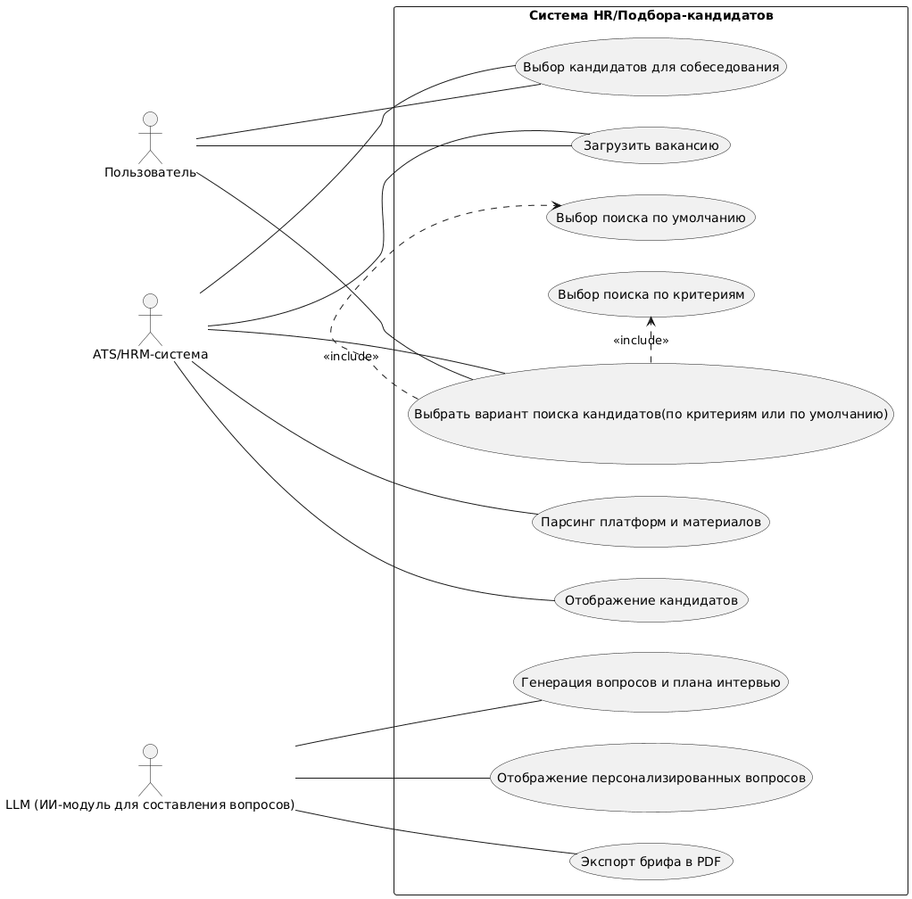

# D2 - Use-case Narrative

## UML Диаграмма

Цель:\
Ускорение процесса отбора кандидатов и повышение качества найма через автоматизацию первичной оценки.

Предусловие:
1) Пользователь (директор начинающего проекта) авторизован в системе;
2) Активно интернет-соединение;
3) У пользователя есть активная вакансия с требованиями.

Flow:
1.	Пользователь выполняет загрузку вакансии через документ или вводом текста;
2.	Пользователь выполняет загрузку резюме в систему;
3.	LLM анализирует данные резюме кандидатов:
    - ключевые навыки и опыт;
    - требования вакансии.
4.	Система рассчитывает скоринг соответствия:
    - выделяет ключевые поля;
    - отсеивает кандитатов, не удовлетворяющих базовым требованиям (например, нет нужного образования или критичного навыка);
    - каждому критерию присваивает вес и ищет совпадения навыков с требованиями;
    - по умолчанию система ищет кандидатов по полному совпадению с требованиями в вакансии без присваивания разного веса критериям;
    - итоговый скоринг резюме = вес * совпадение.
5.	Система отображает кандидатов по рейтингу и предлагает выбрать лучших.
6.	Пользователь выбирает нужных ему кандидатов из списка для проведения собеседования и нажимает кнопку сгенерировать вопросы.
7.	LLM анализирует данные:
    - пробелы в компетенциях;
    - возможные риски и точки соприкосновения.
8.	LLM генерирует персонализированные вопросы для интервью и план беседы для каждого выбранного кандидата:
    - вопросы на проверку опыта;
    - вопросы на выявление пробелов;
    - кейсовые задания (небольшое практическое задание, основанное на реальных задачах вакансии);
    - вопросы на культурное соответствие (на основе анализа описания вакансии и компании);
9.	Система возвращает экран с вопросами по каждому выбранному кандидату.
10.	Пользователь экспортирует персонализированный бриф в PDF.

User value:\
Экономия времени на подготовку к интервью (до 70%), повышение объективности и качества подбора, персонализация вопросов для кандидатов.

## UC1: Создание вакансии и загрузка кандидатов

**Акторы:** пользователь (директор/основатель), система (AI HR Assistant), LLM (внешняя система)\
**Предусловия:** пользователь авторизован; интернет соединение активно, у пользователя есть готовое описание вакансии

Happy Path: 
1. Пользователь загружает описание вакансии (документ или текст)
1. Система парсит и сохраняет требования вакансии
1. Пользователь загружает пакет резюме кандидатов
1. Система подтверждает успешную загрузку и начинает обработку

Alternative Flows:
- AF1: Пользователь выбирает вакансию из списка ранее созданных
- AF2: Пользователь редактирует автоматически распознанный текст вакансии перед сохранением

Error Handling:
- EH1: Неподдерживаемый формат файла → система показывает сообщение с списком допустимых форматов
- EH2: Файл слишком большой → система предлагает разбить на несколько файлов или уменьшить размер
- EH3: Нечитаемый документ → система предлагает альтернативные способы загрузки (копирование текста, другой формат)

User Value:
- Экономия времени на формализацию требований
- Единая точка управления кандидатами

## UC2: Выбор варианта поиска и настройка критериев
**Акторы:** пользователь (директор/основатель), система (AI HR Assistant)\
**Предусловия:** вакансия успешно создана и сохранена в системе, загружено минимум 1 резюме кандидата, система готова к анализу данных

Happy Path:
1. Система предлагает выбрать вариант анализа:
    - По умолчанию - автоматический расчет с равными весами критериев
    - По критериям - с возможностью настройки приоритетов
1. Пользователь выбирает вариант анализа:
    - Если выбран вариант "По умолчанию":
        - Система применяет стандартные настройки весов
        - Переход к UC3
    - Если выбран вариант "По критериям":
        - Система отображает список критериев из вакансии
        - Пользователь назначает веса критериям
        - Пользователь подтверждает настройки

Alternative Flows:
- AF1: Пользователь сохраняет шаблон настроек для повторного использования
- AF2: Пользователь сбрасывает настройки к значениям по умолчанию

Error Handling:
- EH1: Некорректные веса критериев → система показывает предупреждение и предлагает исправить
- EH2: Сумма весов не равна 100% → система автоматически нормализует значения

User Value:
- Контроль над процессом оценки - пользователь может выделить наиболее важные для него критерии
- Возможность выбрать между быстрым анализом "из коробки" и тонкой настройкой под специфичные требования

## UC3: Анализ соответствия и ранжирование кандидатов
**Акторы:** пользователь (директор/основатель), система (AI HR Assistant), LLM (внешняя система)\
**Предусловия:** вакансия успешно создана и сохранена в системе, загружено минимум 1 резюме кандидата, LLM доступна для обработки запросов

Happy Path:
1. Система анализирует резюме кандидатов по критериям вакансии
1. LLM выделяет ключевые навыки, опыт и определяет соответствие
1. Система рассчитывает скоринг по формуле: вес × совпадение
1. Система отображает ранжированный список кандидатов с рейтингами
1. Пользователь просматривает список и выбирает кандидатов для интервью

Alternative Flows:
- AF1: Фильтрация результатов по рейтингу
    - Пользователь устанавливает порог рейтинга (только кандидаты выше 70%)
    - Система фильтрует список согласно установленному порогу
- AF2: Сортировка по конкретному критерию
    - Пользователь выбирает сортировку по опыту, навыкам или образованию
    - Система пересортировывает список

Error Handling:
- EH1: Недостаточно данных для анализа → система предлагает дополнить описание вакансии
- EH2: Нет подходящих кандидатов → система предлагает расширить критерии поиска
- EH3: Ошибка расчета рейтинга → система показывает базовую сортировку по ключевым критериям

User Value:
- Объективная оценка без экспертизы 
- Фокус на лучших кандидатах

## UC4: Генерация персонализированных вопросов и плана интервью
**Акторы:** пользователь (директор/основатель), система (AI HR Assistant), LLM (внешняя система)\
**Предусловия:** пользователь выбрал минимум 1 кандидата из ранжированного списка, завершен анализ соответствия кандидатов, LLM доступна для обработки запросов

Happy Path: 
1. Пользователь выбирает кандидатов и нажимает "Сгенерировать вопросы"
1. Система отправляет данные кандидатов и вакансии в LLM
2. LLM анализирует для каждого кандидата:
    - Пробелы в компетенциях
    - Возможные риски
    - Точки роста и развития
1. LLM генерирует список вопросов, адаптированных под конкретного кандидата и план беседы для каждого выбранного кандидата:
    - вопросы на проверку опыта;
    - вопросы на выявление пробелов;
    - кейсовые задания (небольшое практическое задание, основанное на реальных задачах вакансии);
    - вопросы на культурное соответствие (на основе анализа описания вакансии и компании);
1. Система отображает сгенерированные вопросы для каждого кандидата
1. Пользователь просматривает и утверждает вопросы

Alternative Flows:
- AF1: Пользователь редактирует сгенерированные вопросы перед сохранением
- AF2: ользователь выбирает тип вопросов (технические/поведенческие/кейсовые)

Error Handling:
- EH1: Ошибка генерации вопросов → система предлагает шаблонные вопросы по вакансии
- EH2: Не выбран ни один кандидат → система показывает напоминание о необходимости выбора
- EH3: LLM недоступна → система использует кешированные шаблоны вопросов

User Value:
- Профессиональная подготовка к интервью за минуты 
- Глубокая персонализация вопросов под конкретного кандидата

## UC5: Экспорт результатов
**Акторы:** пользователь (директор/основатель), система (AI HR Assistant)
**Предусловия:** успешно сгенерированы вопросы для выбранных кандидатов, пользователь просмотрел и утвердил вопросы, система готова к формированию документов

Happy Path: 
1. Пользователь нажимает "Экспортировать результаты"
1. Пользователь выбирает формат экспорта (PDF по умолчанию)
1. Система формирует структурированный документ, содержащий:
    - Данные кандидата
    - Персонализированные вопросы
    - План беседы
    - Ключевые моменты для проверки
1. Система генерирует файл в выбранном формате
1. Система предоставляет файл для скачивания
1. Пользователь сохраняет бриф на устройство

Alternative Flows:
- AF1: Пользователь выбирает несколько кандидатов для сравнения в одном документе
- AF2: Пользователь настраивает структуру экспортируемого документа (порядок разделов, включение/исключение определенных блоков)

Error Handling:
- EH1: Ошибка экспорта → система предлагает альтернативные форматы (DOCX, текст)
- EH2: Ошибка генерации PDF → система предлагает повторить попытку или экспортировать в упрощенном формате
- EH3: Большой объем данных → система предлагает разбить экспорт на несколько файлов

User Value:
- Готовый профессиональный бриф для интервью в один клик
- Возможность поделиться результатами с командой или сохранить для архива
- Снижение риска упустить важные моменты во время собеседования
