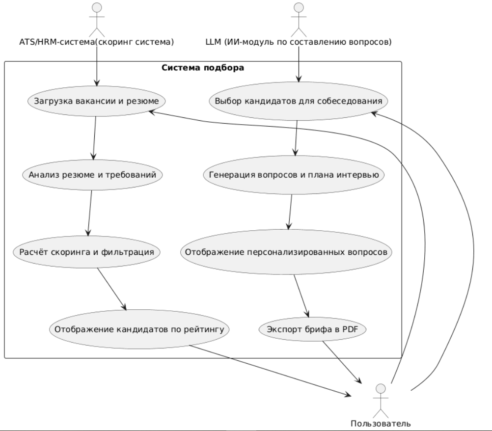

# D2 - Use-case Narrative
## Happy Path

Цель:\
Ускорение процесса отбора кандидатов и повышение качества найма через автоматизацию первичной оценки.

Предусловие:
1) Пользователь (директор начинающего проекта) авторизован в системе;
2) Сервис интегрирован с ATS/HRM-системой или возможна загрузка резюме вручную;
3) У пользователя есть активная вакансия с требованиями.

Flow:
1.	Пользователь выполняет загрузку вакансии и резюме вручную либо через ATS.
2.	LLM анализирует данные резюме кандидатов:
    - ключевые навыки и опыт;
    - требования вакансии.
3.	Система рассчитывает скоринг соответствия:
    - выделяет ключевые поля;
    - отсеивает кандитатов, не удовлетворяющих базовым требованиям (например, нет нужного образования или критичного навыка);
    - каждому критерию присваивает вес и ищет совпадения навыков с требованиями;
    - итоговый скоринг резюме = вес * совпадение.
4.	Система отображает кандидатов по рейтингу и предлагает выбрать лучших.
5.	Пользователь выбирает нужных ему кандидатов из списка для проведения собеседования и нажимает кнопку сгенерировать вопросы.
6.	LLM анализирует данные:
    - пробелы в компетенциях;
    - возможные риски и точки соприкосновения.
7.	LLM генерирует персонализированные вопросы для интервью и план беседы для каждого выбранного кандидата.
8.	Система возвращает экран с вопросами по каждому выбранному кандидату.
9.	Пользователь экспортирует персонализированный бриф в PDF.

Ценность сценария:\
Экономия времени на подготовку к интервью (до 70%), повышение объективности и качества подбора, персонализация вопросов для кандидатов.

## Alternate Flows

1. Нет доступа к ATS/HRM\
Описание: пользователь не подключил интеграцию.\
Реакция системы: сервис предлагает загрузить резюме вручную (PDF/DOCX).\
Ценность: возможность использовать систему даже без интеграции с HR-системами.
2. Нет подключения к интернету\
Описание: пользователь открывает сервис, но соединение с сетью отсутствует.\
Реакция системы: отображается офлайн-сообщение и возможность просмотреть ранее сохранённые результаты.\
Ценность: доступ к подготовленным данным даже без интернета.

## Error Handling

1. Технический сбой сервера, превышение таймаута запроса.\
Описание: при обработке данных сервис возвращает 500 Internal Server Error.\
Реакция системы: уведомление о сбое + предложение повторить позже.\
Ценность: прозрачность работы системы при сбоях.
2. Некорректный ввод данных\
Описание: загружено резюме неподдерживаемого формата (например, JPG-скан).\
Реакция системы: отображается ошибка и подсказка о допустимых форматах (PDF, DOCX).\
Ценность: повышение качества вводимых данных.
3. Превышение лимита запросов\
Описание: пользователь отправляет слишком много запросов подряд (за короткий промежуток времени).\
Реакция системы: уведомление о превышении лимита с указанием времени ожидания.\
Ценность: стабильная работа сервиса при высокой нагрузке.

## UML Диаграмма

